# job4j_cinema
# **Проект Кинотеатр**
## Описание проекта
MVC приложение реализующее сервис по продаже билетов в кинотеатр.
В приложении реализована регистрация пользователей, учет 
купленных билетов. Реализованы функции администратора: добавление, 
редактирование, удаление киносеансов.

## Стек технологий
- Java 17
- PostgreSQL 14, JDBC, Liquibase
- Maven 3.8
- Spring boot 2
- HTML, Bootstrap, Thymeleaf
- JUnit 5

Инструменты:
- Javadoc, JaCoCo, Checkstyle
## Требования к окружению
Java 17, Maven 3.8, PostgreSQL 14
## Запуск проекта
Для выполнения действий данного раздела необходимо установить
и настроить систему сборки проектов Maven.
### 1. Компиляция и запуск проекта.
### 1. Сборка проекта.
Команда для сборки в jar:
`mvn clean package -DskipTests`
### 2. Запуск проекта.
Перед запуском проекта необходимо создать базу данных Cinema
в PostgreSQL, команда для создания базы данных:
`create database cinema;`
Средство миграции Liquibase автоматически создаст структуру 
базы данных и наполнит ее предустановленными данными.
Команда для запуска приложения:
`mvn spring-boot:run`

При создании таблиц средством миграции Liquibase, в базе данных
сохраняется пользователь с правами администратора.
**login (аккаунт) - admin@cinema.ru, password - 1111.** и несколько 
киносеансов в качестве демонстрауции, при необходимости их можно 
удалить и добавить свои.

## Взаимодействие с приложением
Локальный доступ к приложению осуществляется через любой современный браузер
по адресу `http://localhost:8080/`

### 1. Страница приветствия
Со страницы приветствия пользователь может перейти к регистрации, 
либо к странице входа.

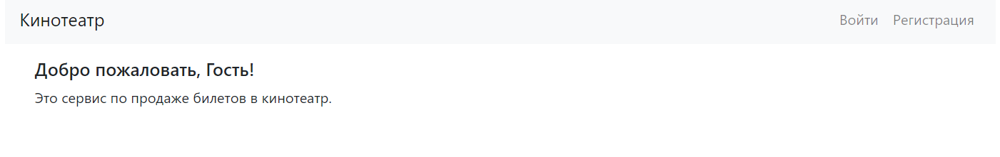

### 2. Страница регистрации
На странице регистрации пользователю необходимо заполнить поля: 
Имя, электронная почта, дважды ввести пароль и телефонный номер.

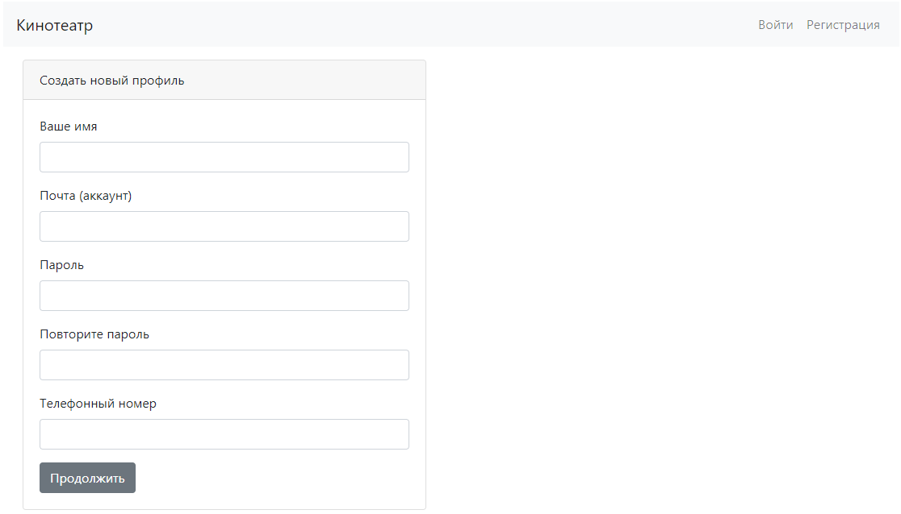

При несоблюдении требований к данных формы, на странице регистрации
будут отражены замечания.
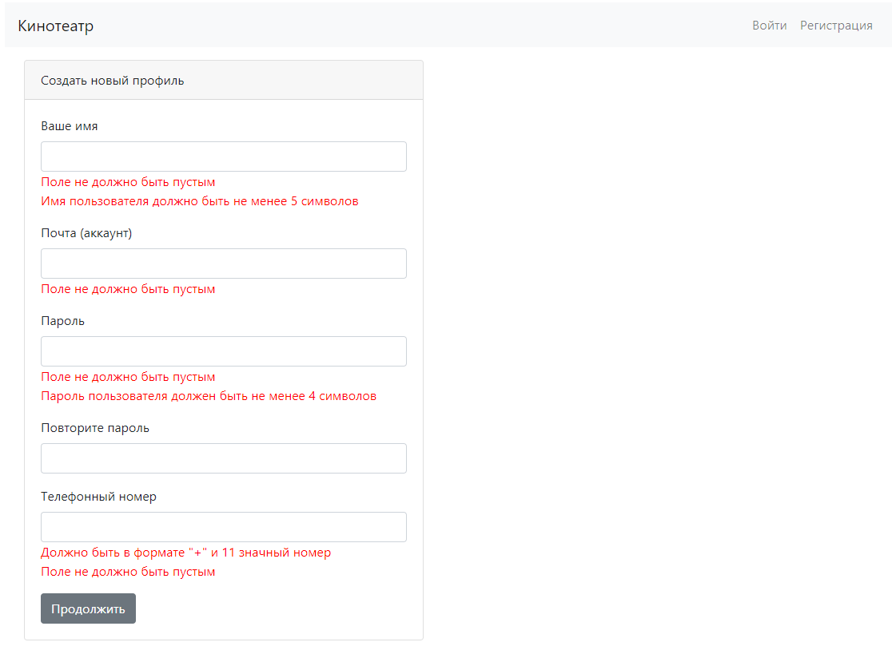

### 3. Страница входа
На странице входа необходимо указать адрес электронной почты и 
ввести свой пароль.

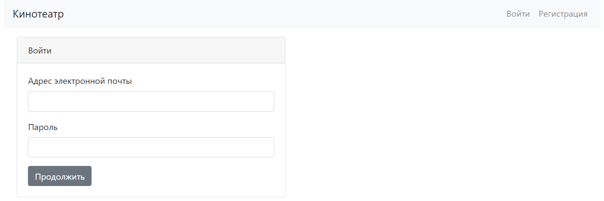

При неправильных учетных данных, об этом будет выведено 
сообщение на странице входа.

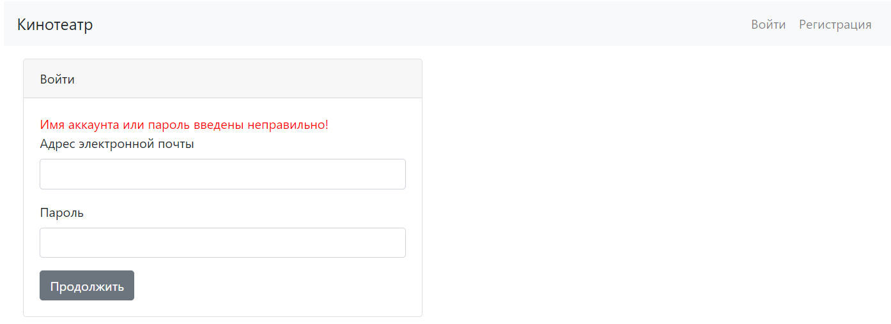

### 4. Список киносеансов
После входа в приложение отображается главная страница со 
списком киносеансов. 
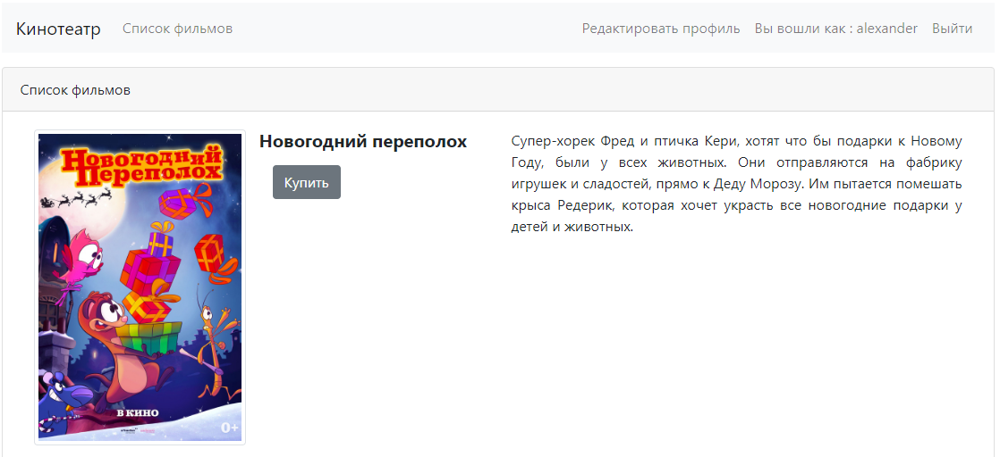

Если пользователь является администратором,
то в панели навигации отображаются дополнительные ссылки, 
доступные только администратору.

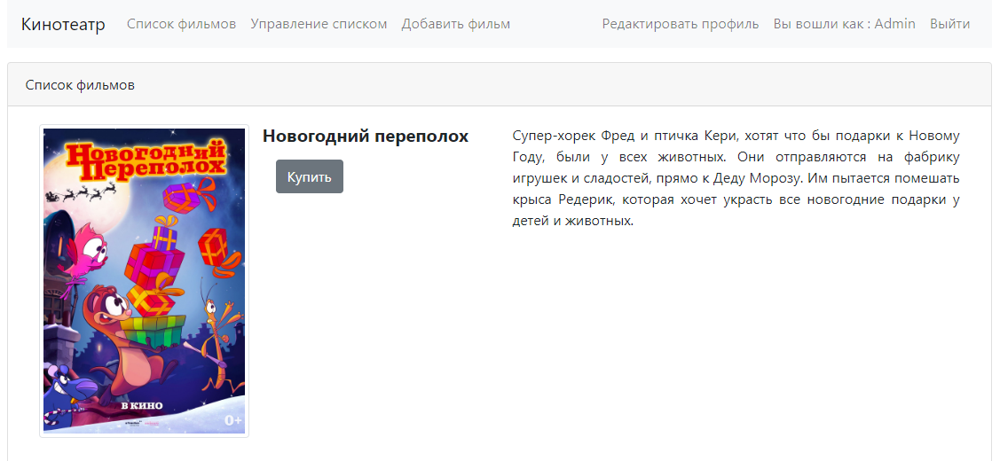

### 5. Покупка билетов
При нажатии на кнопку "Купить" на странице списка киносеансов, 
выполняется переход на страницу выбора ряда.

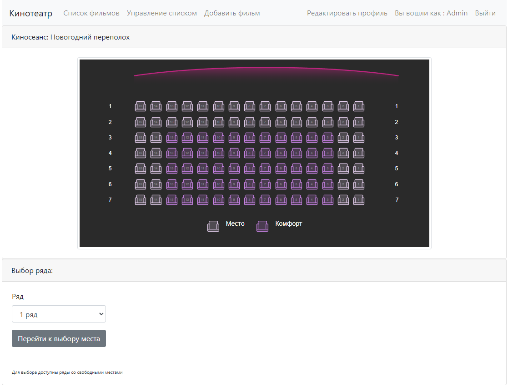

Далее необходимо выбрать место в ряду на странице выбора места.

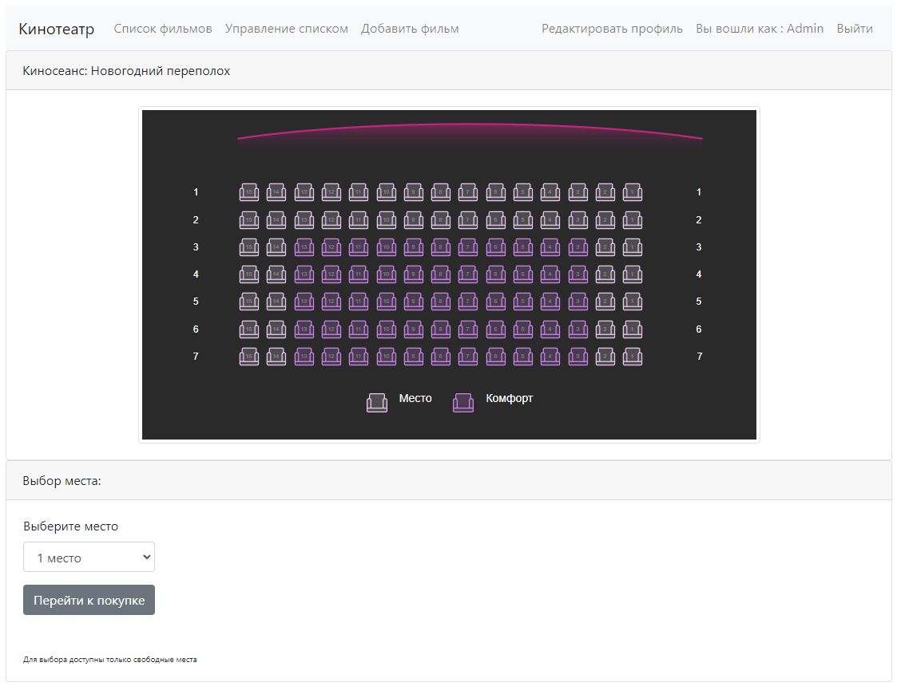

После перехода к покупке, пользователю предлагается проверить 
выбранные параметры билета и подтвердить или отменить покупку.

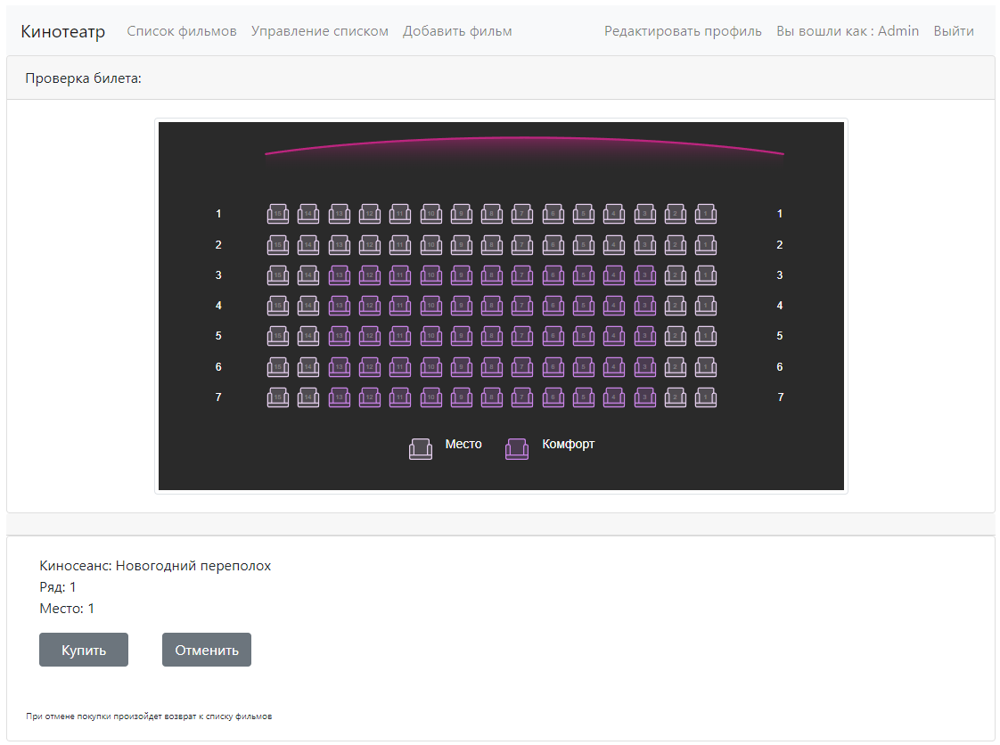

При подтверждении покупки и отсутствии коллизий (одновременной покупкой
с другими пользователями) выполняется переход на информационную страницу 
с сообщением, что билет уже продан.

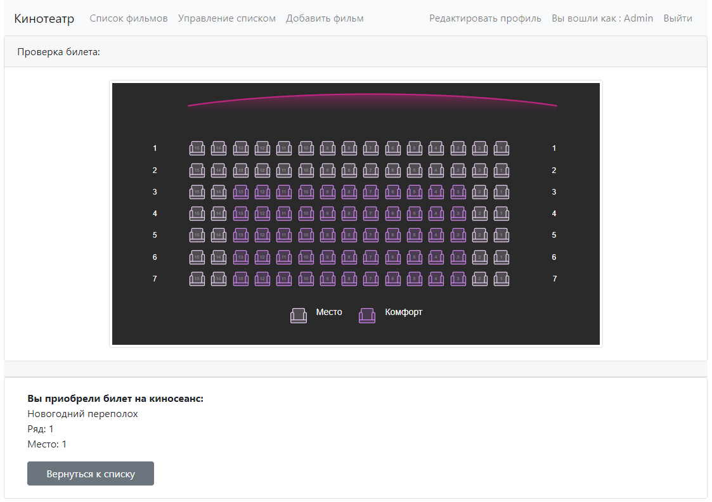

При возникновении коллизии пользователь будет перенаправлен на
страницу с ошибкой.

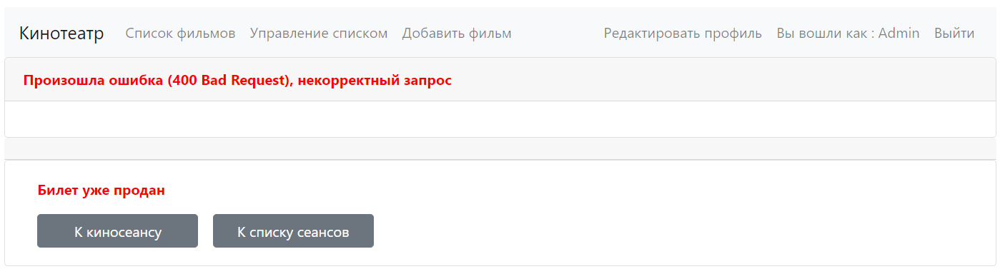

### 7. Управление списком киносеансов
Страница доступна только пользователю с администраторскими правами,
позволяет: очищать списки купленных билетов, удалять и редактировать
киносеансы.

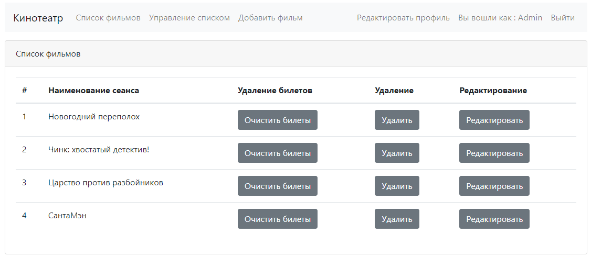

### 8. Добавление киносеанса
Страница добавления киносеанса, необходимо заполнить необходимые поля 
и нажать кнопку "Сохранить", для добавления нового киносеанса в приложение.

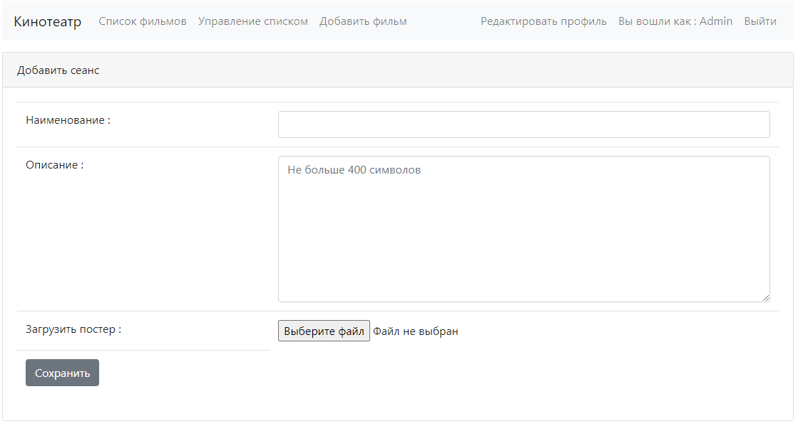

### 9. Редактирование профиля
На странице редактирования профиля можно изменить: имя, пароль, номер телефона.

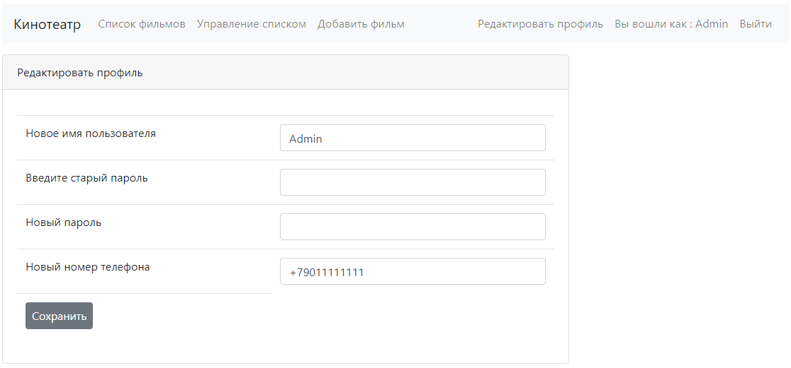

Проверка новых значений данных пользователя происходит по правилам регистрации
и аналогичным выводом ошибок заполнения в соответствующие поля.

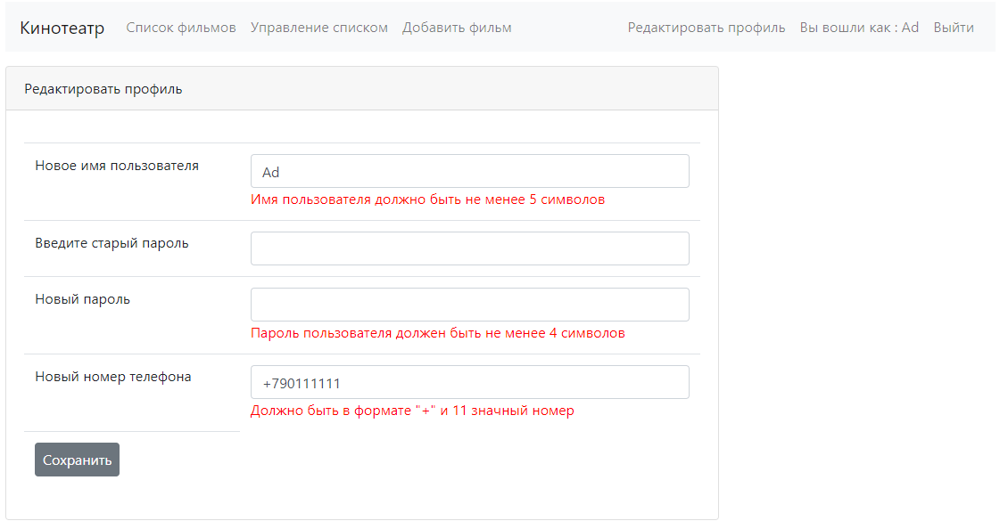

### 10. Выход из приложения
При нажатии в панели навигации на ссылку "Выход", происходит 
выход пользователя из приложения с перенаправлением на страницу входа и 
сообщением о том, что пользователь вышел. При выходе сессия в которой работал
пользователь удаляется.

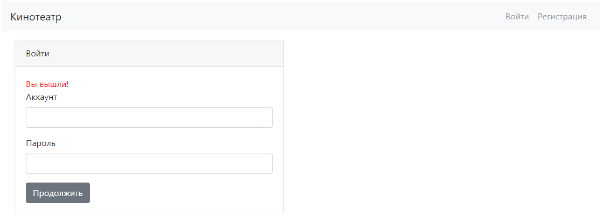

## Контакты
&nbsp;&nbsp;
&nbsp;&nbsp;